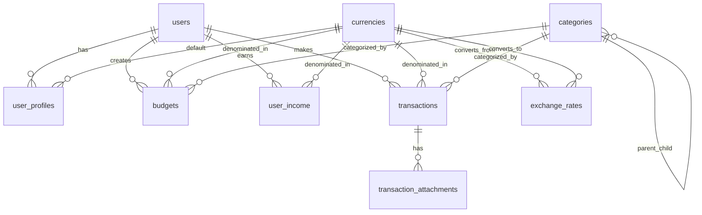

# Database Schema Documentation

This directory contains the PostgreSQL database schema for the Expenses Tracker application, designed for Supabase migration from SQLite.

## 📁 File Structure

```
db/schemas/
├── README.md                    # This documentation
├── schema.sql                   # Complete standalone schema (recommended)
├── index.sql                    # Modular schema with includes
├── users.sql                    # User management tables
├── currencies.sql               # Currency reference table
├── categories.sql               # Expense categories
├── user_profiles.sql            # User preferences and settings
├── budgets.sql                  # Budget management
├── user_income.sql              # Income tracking
├── transactions.sql             # Core financial transactions
├── exchange_rates.sql           # Currency conversion rates
├── transaction_attachments.sql  # File attachments
├── audit_log.sql               # Data change tracking
└── triggers.sql                # Database triggers and functions
```

## 🚀 Quick Start

### Option 1: Standalone Schema (Recommended)
Use the complete `schema.sql` file for easy deployment:

```sql
-- Copy and paste the entire schema.sql content into your Supabase SQL editor
-- This includes all tables, indexes, triggers, and policies in one file
```

### Option 2: Modular Schema
Use the modular approach with `index.sql`:

```bash
# If running via psql from the schemas directory
psql -d your_database -f index.sql
```

## 🗄️ Database Schema Overview

### Core Tables

| Table | Purpose | Key Features |
|-------|---------|--------------|
| `users` | Firebase-authenticated users | Firebase UID, email, profile info |
| `currencies` | Currency reference data | ISO codes, symbols, decimal places |
| `categories` | Expense categories | Hierarchical, customizable, UI-ready |
| `user_profiles` | User preferences | Theme, currency, notifications |
| `budgets` | Budget management | Category-based, period-based |
| `user_income` | Income tracking | Multiple sources, flexible periods |
| `transactions` | Core financial data | Expenses, income, transfers |

### Supporting Tables

| Table | Purpose | Key Features |
|-------|---------|--------------|
| `exchange_rates` | Currency conversion | Historical rates, multiple sources |
| `transaction_attachments` | File attachments | Receipts, invoices, documents |
| `audit_log` | Change tracking | Complete audit trail |

## 🔗 Relationships



## 🎯 Key Design Features

### 1. **UUID Primary Keys**
- All tables use UUID primary keys with `uuid_generate_v4()`
- Ensures global uniqueness and better security
- Compatible with distributed systems

### 2. **Automatic Timestamps**
- `created_at` and `updated_at` fields on all tables
- Automatic `updated_at` triggers for data integrity
- Timezone-aware timestamps (`TIMESTAMPTZ`)

### 3. **Multi-Currency Support**
- Dedicated `currencies` table with 25+ common currencies
- `exchange_rates` table for conversion
- All monetary amounts support different currencies

### 4. **Flexible Categories**
- Hierarchical category structure (parent-child relationships)
- UI-ready with icons and colors
- Extensible for custom categories

### 5. **Comprehensive Budgeting**
- Category-specific budgets
- Multiple budget periods (monthly, weekly, yearly, custom)
- Budget vs actual spending views

### 6. **Rich Transaction Data**
- Unified table for expenses, income, and transfers
- Support for recurring transactions
- Tags and metadata for organization
- File attachment support

### 7. **Audit Trail**
- Complete change tracking via `audit_log` table
- Automatic triggers for INSERT/UPDATE/DELETE operations
- JSONB storage for flexible data capture

### 8. **Row Level Security (RLS)**
- Supabase-compatible security policies
- Users can only access their own data
- Firebase UID-based authentication

## 📊 Performance Optimizations

### Indexes
- **Primary indexes**: All foreign keys and frequently queried columns
- **Composite indexes**: Multi-column queries (user + date + type)
- **GIN indexes**: Array and JSONB columns for fast searches
- **Partial indexes**: Active records only where applicable

### Views
- `transaction_summary`: Pre-joined transaction data with category/currency info
- `budget_vs_actual`: Real-time budget performance calculations

## 🔒 Security Features

### Row Level Security Policies
```sql
-- Users can only access their own data
CREATE POLICY "Users can manage own transactions" 
ON transactions FOR ALL 
USING (auth.uid()::text = (SELECT firebase_uid FROM users WHERE id = user_id));
```

### Data Validation
- CHECK constraints on amounts (>= 0 for budgets/income, > 0 for transactions)
- ENUM constraints on transaction types
- Foreign key constraints with appropriate CASCADE/SET NULL actions

## 🚀 Migration from SQLite

### Key Improvements
1. **Better Data Types**: Proper DECIMAL for money, TIMESTAMPTZ for dates
2. **Enhanced Relationships**: Proper foreign keys with constraints
3. **Multi-Currency**: Full currency support vs single currency
4. **Audit Trail**: Complete change tracking
5. **Performance**: Optimized indexes and views
6. **Security**: Row-level security policies

### Migration Steps
1. **Export SQLite data** using your existing migration scripts
2. **Run schema.sql** in Supabase SQL editor
3. **Import data** with currency conversions
4. **Update application** to use new schema
5. **Test thoroughly** with existing data

## 🔧 Extensibility

### Adding New Tables
The schema is designed for easy extension:

```sql
-- Example: Adding a new table
CREATE TABLE custom_table (
    id UUID PRIMARY KEY DEFAULT uuid_generate_v4(),
    user_id UUID NOT NULL REFERENCES users(id) ON DELETE CASCADE,
    -- your fields here
    created_at TIMESTAMPTZ DEFAULT NOW(),
    updated_at TIMESTAMPTZ DEFAULT NOW()
);

-- Add indexes
CREATE INDEX idx_custom_table_user_id ON custom_table(user_id);

-- Add triggers
CREATE TRIGGER update_custom_table_updated_at 
    BEFORE UPDATE ON custom_table 
    FOR EACH ROW EXECUTE FUNCTION update_updated_at_column();

-- Add RLS policy
ALTER TABLE custom_table ENABLE ROW LEVEL SECURITY;
CREATE POLICY "Users can manage own custom data" 
    ON custom_table FOR ALL 
    USING (auth.uid()::text = (SELECT firebase_uid FROM users WHERE id = user_id));
```

### Adding New Fields
All tables include `metadata JSONB` fields where appropriate for flexible data storage.

## 📈 Analytics and Reporting

### Built-in Views
- **Transaction Summary**: Pre-joined data for dashboards
- **Budget vs Actual**: Real-time budget performance

### Common Queries
```sql
-- Monthly spending by category
SELECT c.name, SUM(t.amount) as total
FROM transactions t
JOIN categories c ON t.category_id = c.id
WHERE t.user_id = $1 
  AND t.transaction_type = 'expense'
  AND t.transaction_date >= DATE_TRUNC('month', CURRENT_DATE)
GROUP BY c.name;

-- Budget performance
SELECT * FROM budget_vs_actual 
WHERE user_id = $1 AND percentage_used > 80;
```

## 🛠️ Maintenance

### Regular Tasks
1. **Exchange Rate Updates**: Update `exchange_rates` table daily
2. **Audit Log Cleanup**: Archive old audit logs periodically
3. **Index Maintenance**: Monitor query performance and add indexes as needed

### Monitoring
- Use Supabase dashboard for query performance
- Monitor `audit_log` table for data changes
- Check `exchange_rates` for currency conversion accuracy

## 📚 Additional Resources

- [Supabase Documentation](https://supabase.com/docs)
- [PostgreSQL Documentation](https://www.postgresql.org/docs/)
- [Row Level Security Guide](https://supabase.com/docs/guides/auth/row-level-security)

---

**Note**: This schema is production-ready and includes all necessary features for a robust personal finance tracking application. It's designed to scale with your needs while maintaining data integrity and performance.
